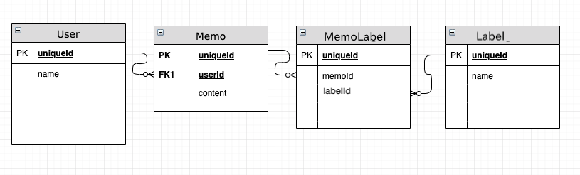
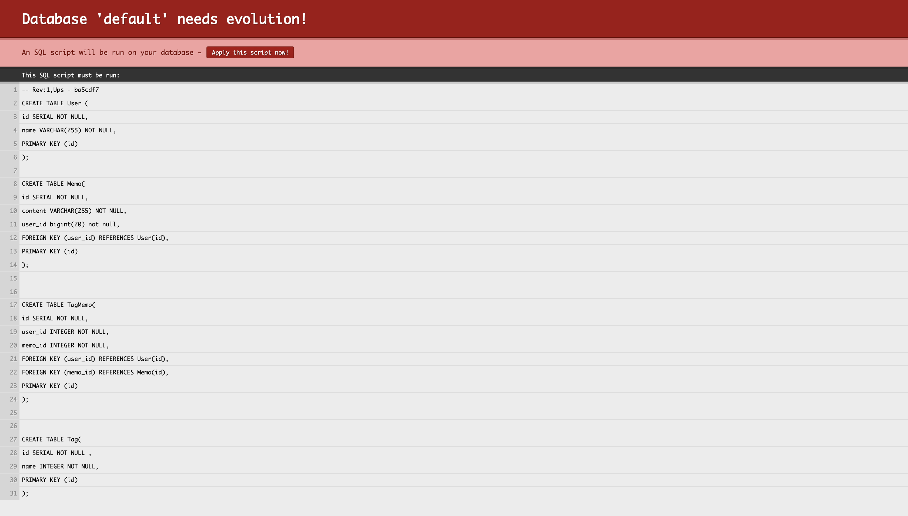

# SlickTutorial

# 概要
[Play Hello World Web Tutorial](https://github.com/playframework/play-samples/tree/2.7.x/play-scala-starter-example)
を使って作ったSlick実験用のgitレポジトリ。

このようなSQLがすでにevolutionでマイグレーションできるようにしてあります。


# 必要環境
- docker(db環境をdocker-composeで作ってます。)
- 


# スタートの仕方
```bash
$ git clone https://github.com/koska-devs/SlickTutorial.git
$ cd SlickTutorial
$ docker-compose up
```
別ターミナルで
```bash
$ sbt run
```
その後
http:localhost:9000にアクセスするとマイグレーションしていないと言った内容のエラー画面になるのでその画面で"Apply This Script"ボタンを押してセットアップ完了。


# このディレクトリを一から作るには

## Docker準備
今回データベースを使うので何かしらDB環境が必要。
一番簡単なのはDockerを使うことだと思うので以下のDockerfileを書く。
Dockerが入っていれば以下のことをやってルートディレクトリで`docker-compose up`するだけなので便利。
今回自分がたまたまpostgresqlを使っているのでpostgresをつかいます。mysqlでもsqlファイルとconfの少ししか違いはないので適宜読み替えてください。


Dockerfile(拡張子なし)という名前のファイルをプロジェクトに作って、

```docker:Dockerfile

FROM postgres:10.1
RUN localedef -i ja_JP -c -f UTF-8 -A /usr/share/locale/locale.alias ja_JP.UTF-8
ENV LANG ja_JP.UTF-8
RUN echo 'create database slick_db_development;' >> /docker-entrypoint-initdb.d/init.sql
RUN echo 'create database slick_db_test;' >> /docker-entrypoint-initdb.d/init.sql
```

今回複数のdockerイメージは使わないので本来いらないが個人的にはdokcer-composeがあった方が色々便利なのでdocker-compose.ymlを作る。


```docker-compose.yml
version: "3"

services:
  db:
    build: .
    ports:
    - "5432:5432"
    environment:
    - "POSTGRES_USER=postgres"
    - "POSTGRES_PASSWORD=password"

```

これで`$docker-compose up`すればDBが起動する。ポートフォワーディングしているのでlocalhost:5432でアクセス可能。


## 実験用Playプロジェクトとライブラリ準備

SlickはPlayの公式になっているのでおそらく一番簡単なのがPlayFrameworkを使うことである。

全くわからない人は以下からダウンロードして、sbt run すれば一応Playサーバーが起動する。sbtのインストールがわからない人は[こちら](https://www.scala-sbt.org/release/docs/ja/Setup.html)（とおもったらプロジェクト内にsbtがおいてあるのでなくても動きますね。）

チュートリアル用プロジェクトダウンロードページ
https://www.playframework.com/getting-started

ただ、なぜかscala 2.13.0だとslick-codegenが失敗するので2.12.8で行う。
まず設定するのはproject/plugins.sbtで、

```scala:plugin.sbt
//これはサンプルに最初から入ってる
addSbtPlugin("com.typesafe.play" % "sbt-plugin" % "2.7.3")


//以下、追加。
//この辺は必要なのか不明
resolvers += "Typesafe repository" at "https://repo.typesafe.com/typesafe/releases/"
addSbtPlugin("org.scalastyle" %% "scalastyle-sbt-plugin" % "1.0.0")

//ここは必要
libraryDependencies+=  "org.postgresql" % "postgresql" % "42.2.5"
```
とりあえずこんな感じで書いておく。余計なのも入っているかもしれない(他のプロジェクトからコピペして明らかにいらないのだけ削除したので)が気にしない。

次にルート直下にあるbuild.sbtに色々追加

```scala:build.sbt

name := """play-scala-seed"""
organization := "com.example"

version := "1.0-SNAPSHOT"

lazy val root = (project in file(".")).enablePlugins(PlayScala)

// ここが最初2.13.0になっているが、slick-codegenがエラーを吐くので2.12にする
scalaVersion := "2.12.8"


libraryDependencies += guice
libraryDependencies += "org.scalatestplus.play" %% "scalatestplus-play" % "4.0.3" % Test

//以下、追加
resolvers += "scalaz-bintray" at "https://dl.bintray.com/scalaz/releases"
resolvers += "Akka Snapshot Repository" at "https://repo.akka.io/snapshots/"

libraryDependencies ++= Seq(
  "com.typesafe.play" %% "play-slick" % "4.0.2",
  "com.typesafe.play" %% "play-slick-evolutions" % "4.0.2",
  "com.typesafe.slick" %% "slick-codegen" % "3.2.0",
  "org.postgresql" % "postgresql" % "42.2.5"
)

```


## slick設定
以下をapplication.confに追加
```scala:application.conf

slick.dbs.default {
  dataSourceClass = org.postgresql.ds.PGSimpleDataSource
  profile = "slick.jdbc.PostgresProfile$"
  db {
    driver = org.postgresql.Driver
    url = "jdbc:postgresql://localhost:5432/slick_db_development"
    databaseName = "slick_db_development"
    user = "postgres"
    password = "password"
  }
  numThreads = 10
}
```


## evolution
マイグレーションツールである。自分のプロジェクトでは使いづらいので[Ridgepole](https://github.com/winebarrel/ridgepole)というRailsで使われているマイグレーションツールをわざわざrubyをいれて使っているが、とりあえず今回はこれでok。

evolutionではconf/evolutions/defaultにマイグレーションファイルを入れるのがプラクティスみたいなのでそこに1.sqlというファイルを作ってSQLを書く。(せめてrailsみたくタイムスタンプを使ってほとんどユニークなファイルを自動生成とかしてほしい・・・)

Upsが生成時、Downsがロールバック時の処理を書くそうです。
```sql:1.sql
-- Users schema

-- !Ups
CREATE TABLE public.User(
  id SERIAL NOT NULL,
  name TEXT NOT NULL,
  PRIMARY KEY (id)
);

CREATE TABLE public.Memo(
  id SERIAL NOT NULL,
  content TEXT NOT NULL,
  user_id INTEGER NOT NULL REFERENCES public.User(id),
  PRIMARY KEY (id)
);

CREATE TABLE public.Label(
  id SERIAL NOT NULL ,
  name INTEGER NOT NULL,
  PRIMARY KEY (id)
);


CREATE TABLE public.LabelMemo(
  id SERIAL NOT NULL,
  memo_id INTEGER NOT NULL REFERENCES public.Memo(id),
  tag_id INTEGER NOT NULL REFERENCES public.Label(id),
  PRIMARY KEY (id)
);


-- !Downs
DROP TABLE public.User CASCADE;
DROP TABLE public.Label CASCADE;
DROP TABLE public.Memo CASCADE;
DROP TABLE public.LabelMemo CASCADE;


```

これで上のslick設定も行いサーバー起動すると、slickの設定を読んでいるのかevolutionもDBを読めるようになっている。
ただ、マイグレーションしていないとこういう画面が出る。



ここの "Apply this script now!"ボタンを押す事でマイグレーションされ、エラーを吐かなくなる。